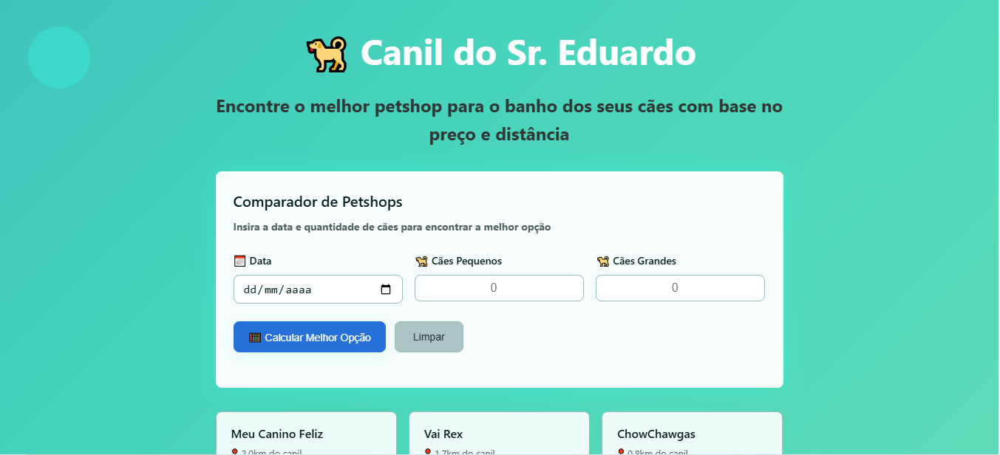

# 🐾 Case Canil DTI

Aplicação desenvolvida como parte de um desafio técnico para a DTI Digital, com o objetivo de comparar petshops e indicar o mais vantajoso para banhos de cachorros, considerando a data do serviço e o número de cães pequenos e grandes.

## 🚀 Tecnologias Utilizadas

-   **Backend:** Java 17, Spring Boot, JUnit, e Lombok
-   **Frontend:** HTML, CSS, e JavaScript (servido estaticamente pelo backend)
-   **Monorepo:** O projeto é estruturado como um monorepo, com o frontend dentro do diretório `src/main/resources/static` do Spring Boot.

## 🛠️ Como executar o projeto

### Pré-requisitos

-   Java 17+
-   Maven 3.8+

### Instruções

1.  Clone o repositório:
    ```bash
    git clone https://github.com/Airesp4/case-canil-dti.git
    cd case-canil-dti
    ```

2.  Compile e execute o projeto com o Maven:
    ```bash
    ./mvnw spring-boot:run
    ```

3.  Acesse a aplicação no navegador:
    ```
    http://localhost:8080
    ```

### 🐳 Executando com Docker

Se preferir rodar a aplicação em um contêiner Docker, siga estes passos:

1.  Clone o repositório:
    ```bash
    git clone https://github.com/Airesp4/case-canil-dti.git
    cd case-canil-dti
    ```

**Certifique-se de ter o Docker instalado e rodando.**

2.  **Construa a imagem** Docker:
    ```bash
    docker build -t case-canil .
    ```

3.  **Execute o contêiner**:
    ```bash
    docker run -p 8080:8080 case-canil
    ```

4.  Acesse a aplicação no navegador:
    ```
    http://localhost:8080
    ```

## 📌 Premissas Assumidas

-   Por se tratar de uma aplicação simples, com poucas funcionalidades e telas, optei por **servir o frontend estaticamente via Spring Boot**, sem a complexidade de frameworks como Angular ou a biblioteca React.
-   Os cards exibidos no frontend utilizam dados mockados apenas para compor visualmente a interface. Os dados reais utilizados nos cálculos são processados corretamente pelo backend com base no input do usuário.
-   Os dados dos petshops utilizados nos cálculos são fixos no backend e **não utilizam banco de dados**.
-   A validação de dados de entrada do usuário é feita com base no formato e tipo esperados, e instruções de erro são exibidas em caso de dados inválidos.

## 💡 Decisões de Projeto

-   **Monorepo**: A arquitetura monorepo permite que o backend Spring Boot sirva os arquivos de frontend (HTML/CSS/JS) de maneira integrada, simplificando o deploy.
-   **Lógica de Negócios no Backend**: A regra de negócio para a comparação de preços foi completamente implementada no backend. Isso mantém o frontend leve, focado na interface e na apresentação dos resultados.
-   **Interface Aprimorada**: O design da interface foi pensado para ser intuitivo e visualmente agradável, com cores acessíveis e um layout responsivo que se adapta a diferentes tamanhos de tela.
-   **Padrão REST**: A comunicação entre o frontend e o backend é organizada seguindo o padrão REST, garantindo uma interação clara e padronizada.
-   **Estrutura de Código**: O projeto segue uma estrutura de camadas e modularização, facilitando a organização, manutenção e escalabilidade do código.

## ✨ Melhorias visuais

-   **Alinhamento e espaçamento**: O layout foi aprimorado com alinhamento refinado de botões e campos de entrada.
-   **Contraste e Legibilidade**: As cores foram ajustadas para garantir um melhor contraste, tornando a leitura mais fácil e a interface mais agradável.
-   **Humanização da Interface**: Elementos visuais como ícones e GIFs foram adicionados para dar mais personalidade à aplicação, criando uma experiência mais amigável.

## 🚀 O que mais é importante compartilhar sobre o projeto

-   **Testes Unitários**: A lógica de negócios principal foi coberta com testes unitários usando **JUnit**, garantindo a corretude dos cálculos de preço e a robustez da aplicação.
-   **Código Limpo e Padrões de Qualidade**: O projeto foi desenvolvido com foco em código limpo, legibilidade e manutenibilidade. O uso de **Lombok** ajudou a reduzir o _boilerplate code_, mantendo as classes mais concisas.
-   **Preparo para Persistência de Dados**: A arquitetura do projeto foi desenhada para permitir a fácil integração com um banco de dados. Com a separação de responsabilidades, seria possível, sem grandes problemas, **atribuir um banco de dados para persistir as informações dos petshops e adicionar funcionalidades CRUD (Create, Read, Update, Delete)** para gerenciar esses dados dinamicamente.
-   **Design Modular**: A arquitetura de camadas (controllers, services, repositories) facilita a separação de responsabilidades e permite que novas funcionalidades sejam adicionadas no futuro com o mínimo de impacto nas partes existentes.

## 📸 Captura de Tela

> 

## Conclusão

O **Case Canil DTI** demonstra uma abordagem sólida e prática para a resolução do problema proposto. A aplicação não só entrega a funcionalidade central de comparação de petshops de forma eficiente e com uma interface agradável, mas também foi construída sobre uma base técnica robusta. A arquitetura modular e as boas práticas de código garantem que o projeto é escalável, fácil de manter e preparado para futuras expansões, como a integração com um banco de dados e a criação de um sistema de gerenciamento de dados completo.
